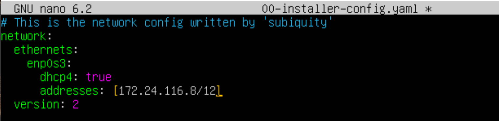
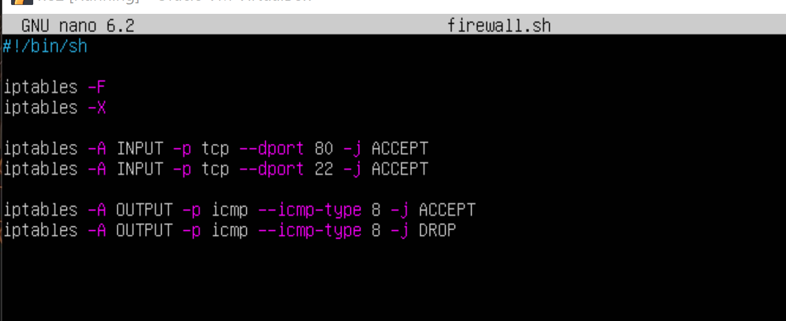

# Linux Network

## Part 1

### 1.1
1) Адрес сети 192.167.38.54/13
		192.160.0.0/13

3) Перевод маски 255.255.255.0 в префиксную и двоичную запись, /15 в обычную и двоичную, 11111111.11111111.11111111.11110000 в обычную и префиксную

	Перевод маски 255.255.255.0:
	
	Двоичная запись == 11111111.11111111.11111111.00000000
	Префиксная запись == /24
	
	Перевод маски /15:

	Двоичная запись == 111111111.11111110.00000000.00000000
	Обычная запись == 255.254.0.0

	Перевод маски  11111111.11111111.11111111.11110000:

	Обычная запись == 255.255.255.240
	Префиксная запись == /28
		
		

5) Минимальный и максимальный хост в сети 12.167.38.4 при масках: /8, 11111111.11111111.00000000.00000000, 255.255.254.0 и /4

	12.167.38.4/8

	HostMin == 12.0.0.1
	HostMax == 12.255.255.254

	12.167.38.4/16

	HostMin == 12.167.0.1
	HostMax == 12.167.255.254

	12.167.38.4/23

	HostMin == 12.167.38.1
	HostMax == 12.167.39.254

	12.167.38.4/4

	HostMin == 0.0.0.1
	HostMax == 15.255.255.254

### 1.2

"*Наиболее широко используемый IP адрес в механизмах loopback — 127.0.0.1. В IPv4, в него также отражается любой адрес в пределах от 127.0.0.0 до 127.255.255.255. Стандартное, официально зарезервированное, доменное имя для этих адресов — localhost"

Следовательно среди данных адресов: 194.34.23.100, 127.0.0.2, 127.1.0.1, 128.0.0.1, обратяться к localhost только 127.0.0.2 и 127.1.0.1

### 1.3

Среди адрессов: _10.0.0.45_, _134.43.0.2_, _192.168.4.2_, _172.20.250.4_, _172.0.2.1_, _192.172.0.1_, _172.68.0.2_, _172.16.255.255_, _10.10.10.10_, _192.169.168.1_

Частные: _10.0.0.45_ ; _192.168.4.2_ ; _172.20.250.4_ ; _172.16.255.255_ ; _10.10.10.10.

Для адреса 10.10.0.0/18 :

	Hostmin == 10.10.0.1
	Hostmax == 10.10.63.254

Следовательно, из возможных шлюзов  _10.0.0.1_, _10.10.0.2_, _10.10.10.10_, _10.10.100.1_, _10.10.1.255_
могут являтся шлюхами: _10.10.0.2_ ; _10.10.10.10_ ; _10.10.1.255_ ;

## Part 2

### 2.1

ip a внутри ws1:

ip a внутри ws2:

lo ==  Любой трафик, который посылается компьютерной программой на интерфейс loopback, тут же получается тем же интерфейсом (адрес localhost).

enp0s3 == Сетевой адаптер ethernet

enp0s8 == Доступ к локальной сети (Добавили локальную сеть в адаптерах сети внутри VM)

Выставление IP адресов:

	ws1

	ws2

Сверху dchp4: false, извините
Добавляем route соответствуеющие адреса:

	ws1

	ws2

Для обеих vm:

Так как моя версия Ubuntu 22.04.4, что отличается от необходимой в проекте (прошу прощения, впадлу переделывать, так как разница минимальна), вылетает предупреждение об отсуствии ovsdb-server.service, что никак не влияет на работу.

Пингуем:

	ws1

	ws2

Устанавливаем постоянное соединение через netplan:

Указание маски сети в маршруте -- ошибка.

Пинг на ws1:

Пинг на ws2:

## Part 3

1. Скорость 8 мегабит в секунду эквивалентна 1 мегабайту в секунду.
2. Скорость 100 мегабайт в секунду эквивалентна 800000 килобитам в секунду.
3. Скорость 1 гигабит в секунду эквивалентна 1000 мегабитам в секунду.

Проверяем скорость соединение между ws1 (iperf3 -s -f K, т.е. "слушаем на порту 5201")
и ws2 (iperf3 -c 192.168.100.10, т.е. отправляем запрос на слушающую ws2)

ws1:

ws2

## Part 4

ws1

Итоговые правила:

ws2

Итоговые правила:

Пинг первой машины ws1:

Пинг ws2:

Первая машина пингуется, а вторая -- нет. Принятие echo reply зависит от того, какое правило первое. Если первое правило запрещающее, то правило принятие не рассматривается и наоборот.

Nmap

## Part 5

ws11

r1

Пропинговали ws1 r1

r2

ws 22

ws 21

Пинг ws21 и r2

ip -4 a

Для ws11:

Для ws21 ws22:

Для r1 r2:

Установка маршрута:

Установка маршрута по-умолчанию:

r1

r2

Меняем маршруты рабочих станций:

Пингуем r1 в ws1:

получили на r2 echo request

Проверяем routes с помощью ip r:

ws11:

ws21:

ws22:

Добавляем адрес в соседнюю сеть в роутерах:

r1:

r2:

ip r для r1:

ip r для r2:

Для адреса 10.10.0.0/18 не был выбран маршрут 0.0.0.0/0, потому что пакеты отправляется на него только тогда, когда другой маршрут не задан явным образом в таблице маршрутизации 
хоста. Так как ws11 находится внутри сети 10.10.0.0/18, то для связи с ней она использует 
свой IP-адрес 10.10.0.2. Адрес 0.0.0.0/0 находится в другой сети, поэтому ws1 отправляет 
данные на роутер, используя маршрут по умолчанию, прописанный в файле конфигурации (10.10.0.1)

traceroute c ws11 на ws21

запрос посылается на через r1 (10.10.0.1), который пересылает его в cеть 10.20.0.0 на шлюз 10.20.0.10 через r2 (10.100.0.12)

tcpdump -tnv -i eth0 на r1:

Пинг ws11 на адрес 10.30.0.111

Прослушивание icmp пакетов на r1

## Part 6

Изменил в neplan ws21 ws22 r2 dhcp4 c false на true

r2 dhcpd.conf

r2 resolv.conf

Перезапускаем dhcp сервер на r2

Перезагрзив систему на ws21 получаем новый ip == 10.20.0.3

Пинг ws21 с ws22

Измененный netplan ws11

Настраиваем r1

Перезапускаем ws11 

ip адрес изменился на фиксированный 10.10.0.7, который указан в dhcpd.conf r1

ws21 до

Вводим 
	dhclient -r (освобождение старых ip) 
	dhclient (получение нового)

ws21 после

Получили ip адресс 10.20.0.5

## Part 7

Следующие несколько скринов идентичны дня ws22 и r1

Запускаем фаервол

Пинг с r1 ws22:

Добавляем разрешение icmp пакетов

Правила для r2:

r1 к ws22

ws22 к r1

r1 к ws22 через порт 8080 на r2

## Part 8

Также поставили разрешение пересылки всез пакетов в правилах r1

подключениe Local TCP forwarding

Пингуем

подключение Remote TCP forwarding

Пингуем

